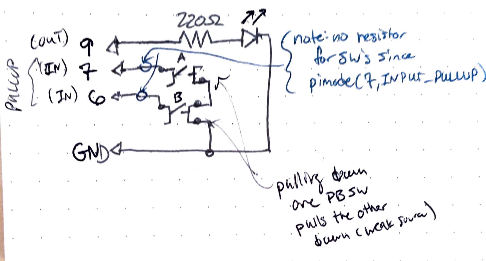

parent::[tmi Examples](../../../tmi%20Examples.md)
next:: [[tmi03 Digital Inputs Debounce w Millis]]
previous::
level:: #beginner

>  from Elegoo Lesson 5 Digital Inputs

Desired Goal:
- Pressing Pushbutton A turns on the LED & pressing Pushbutton B turns off the LED (no debouncing needed)

Concepts:
- digital inputs
- pullup resistors and inverted logic

Physical Setup:


Code:
See [tmi02_Digital-Inputs](tmi02_Digital-Inputs/tmi02_Digital-Inputs.ino)

``` c
int LED = 9;
int BUTTON_A = 7;
int BUTTON_B = 6;

void setup() 
{
  pinMode(LED, OUTPUT);
  pinMode(BUTTON_A, INPUT_PULLUP);  // pullup = normal HIGH or 5V   
  pinMode(BUTTON_B, INPUT_PULLUP);  // switches are connected to ground
}

void loop() 
{
  if (digitalRead(BUTTON_A) == LOW) // LOW = button press
  {
    digitalWrite(LED, HIGH);
  }
  if (digitalRead(BUTTON_B) == LOW)
  {
    digitalWrite(LED, LOW);
  }
}
```

Improvements:
- have one button toggle between states (need debounce)