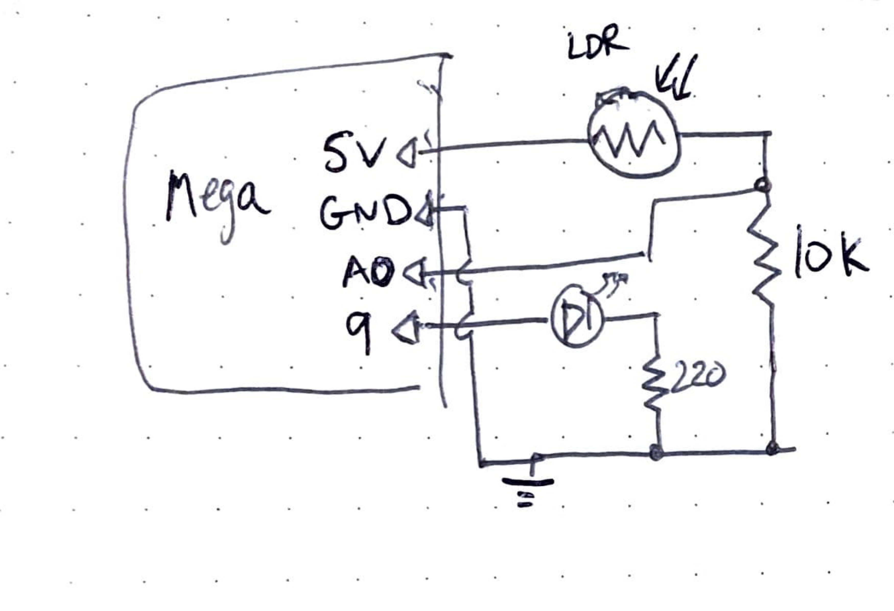

parent::[tmi Examples](../../../tmi%20Examples.md)
next::
previous::[tmi05 Pushbutton LED Fade](tmi05%20Pushbutton%20LED%20Fade.md)
level:: #beginner

> From [Getting Started With Arduino](../banziGettingStartedArduino.md) Example 5-4.

Desired Goal:
- Set the LED to a brightness specified by the value of the analog input given by the LDR 

Concepts:
- [Arduino - PWM](../../../Arduino%20-%20PWM.md) -  analogWrite() vs analogRead()
- [LDR](LDR.md)s
- voltage divider - converting a variable resistance to a measurable voltage

Physical Setup:



Code:

Also in [tmi06_LDR-analogWrite-to-LED](tmi06_LDR-analogWrite-to-LED/tmi06_LDR-analogWrite-to-LED/tmi06_LDR-analogWrite-to-LED.ino)

``` c
// Description:Set the LED to a brightness specified by the value of 
// the analog input given by the LDR 

// Constants
const int LED = 9;
const int analogPin = A0;

// Inputs
unsigned int val = 0; // analog input read value

// Other Variables

void setup() {
  pinMode(analogPin, INPUT); // note: not needed since analog pins are INPUT by default
  pinMode(LED, OUTPUT);
}

void loop() {
  val = analogRead(analogPin);
  analogWrite(LED, val/4); // since analogRead() is 16 bit but analogWrite is 8 bit ()
  delay(10);
}

```

Improvements:
- choose a resistor attached to the LDR so that the LED turns all the way off when it is covered