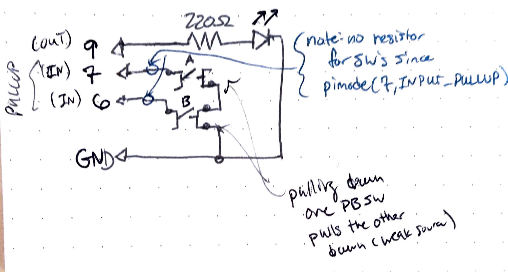

parent::[tmi Examples](tmi%20Examples.md)
previous:: [tmi02 Digital Inputs](tmi02%20Digital%20Inputs.md), 
next:: [tmi04 RGB LED](tmi04%20RGB%20LED.md), [tmi05 Pushbutton LED Fade](tmi05%20Pushbutton%20LED%20Fade.md)
level:: #beginner

>  Adapted from Elegoo Mega2560 Starter Kit Lesson 5 and https://forum.arduino.cc/t/long-press-toggle-output-high-and-low/587500/3

> Very similar to [tmi05 Pushbutton LED Fade](tmi05%20Pushbutton%20LED%20Fade.md) 

Desired Goal:
- Toggle the LED on and off with a pushbutton
- Debounce the pushbutton in software (see [tmi05 Pushbutton LED Fade](tmi05%20Pushbutton%20LED%20Fade.md) first for an easier example)

Concepts:
- [Multitasking and non blocking delays](../../Multitasking%20and%20non%20blocking%20delays.md)
- [Debouncing](Debouncing) - Blink Without Delay (BWD) - using `millis()` and not `delay()`
- `byte` vs `ints` vs `longs` 
- Digital inputs & pullup resistors

Physical Setup:

Same as in the previous but with only one pushbutton.

- 
Notes on debouncing
- always taking the current time at the beginning of each loop
- reading the button state
- if the button state changes we start a debouncing timer, store this state, and keep track of if we are debouncing
- the loop continues to execute (doesn't enter the `else if` statement yet)
- then we check that 1) we are debouncing 2) the button state is as required 3) enough time has elapsed to take this value as true

Code:


So it needs the variables
- `debounce_start`
- `current_time` (to store `millis()` at the beginning of each loop)
- `debouncing` flag
- `old_state` to compare with the new state 

Also see [tmi03_Digital-Inputs-Debounce-Millis](tmi03_Digital-Inputs-Debounce-Millis/tmi03_Digital-Inputs-Debounce-Millis.ino)

``` c
// Inputs
const int LED = 9;
const int BUTTON = 7;

// Others
byte state = HIGH; // due to the pullup
byte old_state = HIGH;
byte led_state = LOW;
unsigned long debounce_start = 0;
unsigned long current_time; 
bool debouncing = false;

void setup(){
  pinMode(LED, OUTPUT);
  pinMode(BUTTON, INPUT_PULLUP);  // pullup = normal HIGH or 5V   
}

void loop(){
  current_time = millis();

  state = digitalRead(BUTTON); // PULLUP so normal is HIGH
  if (state != old_state)
  { // either button is pressed or it is noise
    debounce_start = current_time;     // reset debouncing timer
    old_state = state;
    debouncing = true; // we are debouncing
  }
  else if (debouncing && state == LOW && (current_time - debounce_start > 50))
  { // else if is key here
    // take the current value as the actual state
      led_state = (led_state == LOW ? HIGH : LOW); // ternary operator to switch led state
      digitalWrite(LED, led_state);
      debouncing = false;
  }
}
```

Note, you would think we could get rid of the `debouncing` boolean and just check for the time condition, but what happens when we hold down the button?  The following condition cycles between true and false.

```c
else if (debouncing && state == LOW && (current_time - debounce_start > 50))
```
Improvements:
- it is better not to use hardcoded magic numbers like `50` in the delay comparison time