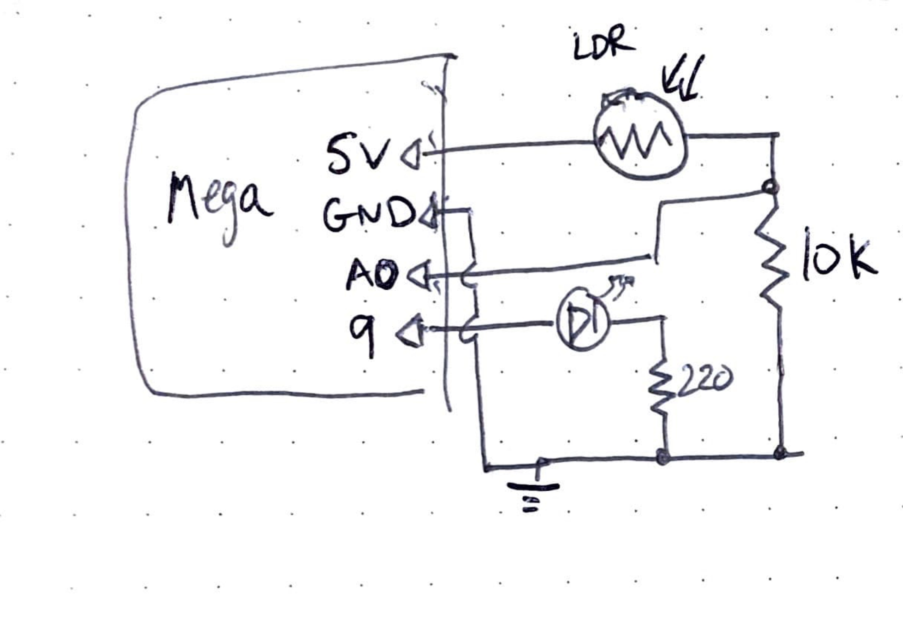

parent::[tmi Examples](tmi%20Examples.md)
previous::[tmi05 Pushbutton LED Fade](tmi05%20Pushbutton%20LED%20Fade.md)
next:: [tmi07 Buzzers](tmi07%20Buzzers.md)
level:: #beginner

> From [Getting Started With Arduino](banziGettingStartedArduino.md) Example 5-4 & 5-5

Desired Goal:
- Set the LED to a brightness specified by the value of the analog input given by the LDR 

Concepts:
- [Arduino - PWM](../../Arduino%20-%20PWM.md) -  analogWrite() vs analogRead()
- [LDR](LDR.md)s
- voltage divider - converting a variable resistance to a measurable voltage
- [Serial Communication](../../Serial%20Communication.md) - the most basic printing of serial values to the monitor

Physical Setup:



Code:

Also in [tmi06_LDR-analogWrite-to-LED](tmi06_LDR-analogWrite-to-LED/tmi06_LDR-analogWrite-to-LED/tmi06_LDR-analogWrite-to-LED.ino)

``` c
// Description:
// Set the LED to a brightness specified by the value of 
// the analog input given by the LDR and
// print the analog value to the Serial Monitor

// Constants
const int LED = 9;
const int analogPin = A0;

// Inputs
unsigned int val = 0; // analog input read value

// Other Variables

void setup() {
  pinMode(analogPin, INPUT); // note: not needed since analog pins are INPUT by default
  pinMode(LED, OUTPUT);
  Serial.begin(9600); // open the serial port at 9600 baud (bits per second)
}

void loop() {
  val = analogRead(analogPin);
  Serial.println(val);
  delay(100);
  analogWrite(LED, val/4); // since analogRead() is 16 bit but analogWrite is 8 bit ()
}

```

Improvements:
- choose a resistor attached to the LDR so that the LED turns all the way off when it is covered