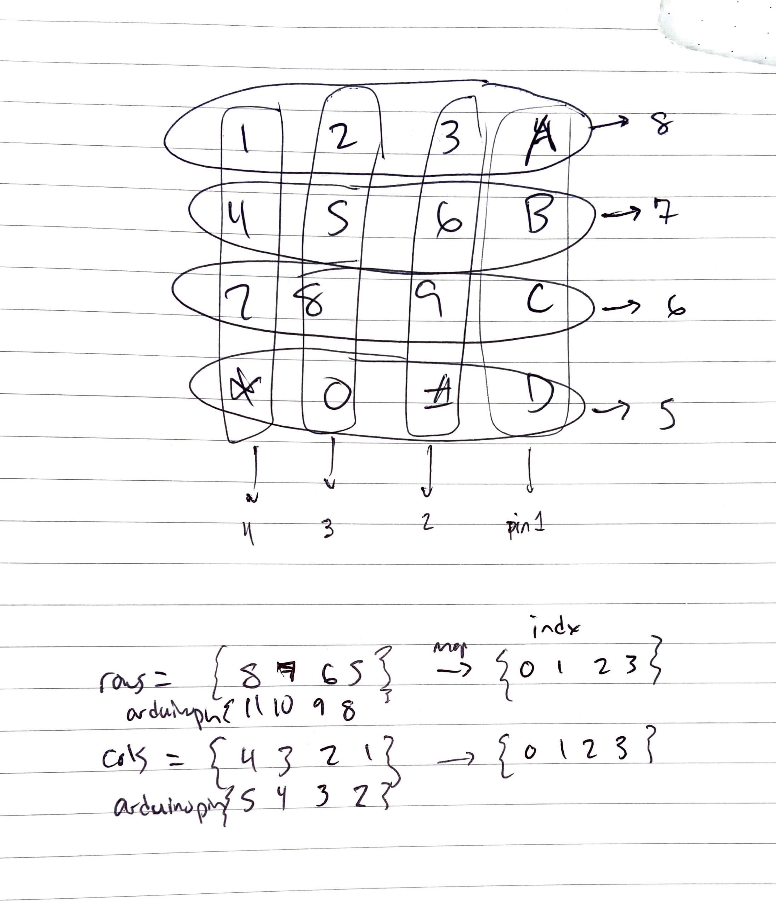

parent::[tmi Examples](Personal%20Folders/that_marouk_ish/tmi%20Examples.md)
previous:: [tmi09 Ultrasonic Sensor](tmi09%20Ultrasonic%20Sensor.md)
next:: [tmi11](tmi11.md)
level:: #beginner
garden-topic:: [Matrix Keypad](../../Matrix%20Keypad.md)

>  (source)

Desired Goal:
- Display the keypress on the Serial Monitor without using a Keypad library

Concepts:
- arrays, with correct ordering
- nested loops
- internal pullup resistors

**Physical Setup:**

The keypad has 8 output pins but 16 keys.
- columns:  pins 1-4 (columns from right to left)
- rows: pins 5-8 (rows from bottom to top)

The corresponding connected Arduino pins (Arduino pin <-  Keypad Pin):

**Matrix Columns**
- 2 <- 1 (rightmost pin, rightmost col "ABCD")
- 3 <- 2 
- 4 <- 3
- 5 <- 4 (leftmost col "147\*")

**Matrix Rows**
- 8 <- 5 (bottom row "\*0#D")
- 9 <- 6
- 10 <- 7
- 11 <- 8 (top row "123A")

> Since the pins are defined from right to left and top to bottom, but we access an array as top to bottom and left to right, we reverse this in the pin array definition (see codeblock below)

```c 
const int pinCols[4]={5, 4, 3, 2}; 
const int pinRows[4]={11, 10, 9, 8};
```


Here is the mapping to the correctly indexed array of chars. 


Code:

``` c
// remixed from https://forum.arduino.cc/t/keypad-without-keypad-library/656198/7
// added pullup inputs and re-defined keys

const int pinCols[4]={5, 4, 3, 2}; // reverse order array is needed to access and print correctly
const int pinRows[4]={11, 10, 9, 8};

char keys[4][4]={
  {'1','2','3','A'},
  {'4','5','6','B'},
  {'7','8','9','C'},
  {'*','0','#','D'}
};

void setup() {
  Serial.begin(9600);
  
  for(int i=0; i<4; i++) {
    // set Rows as Input (high Z floating)
    pinMode(pinCols[i], INPUT);
    // set Cols as Pullup Input (normal  +VCC)
    pinMode(pinRows[i], INPUT_PULLUP);
    // digitalWrite(pinCols[i], HIGH);
  }
}

void loop() {
  readKey();
  delay(100);
}

void readKey(){
  // Columns 
  for (int c=0; c<4; c++) {
    // provide ground path from a rows' Internal Pullup Resistor (see below)
    pinMode(pinCols[c], OUTPUT);
    digitalWrite(pinCols[c], LOW);
    // Rows 
    for(int r=0; r<4; r++){
      // set the row as HIGH with an INPUT_PULLUP 
      // a button press will provide a path to ground since the column pin is set LOW
      // logic is inverted so if we read a pin LOW then the button is pressed
      pinMode(pinRows[r], INPUT_PULLUP);
      if (digitalRead(pinRows[r]) == LOW) { 
        // display the right symbol
        // make sure to define keys in correct order when initializing
        // i.e. the index is reversed from the pin order
        Serial.println(keys[r][c]); 
      }

      // reset row pin to high impedance floating
      pinMode(pinRows[r], INPUT); 
    }

    // reset col pin
    pinMode(pinCols[c], INPUT); 
  }
}
```

Improvements:
- store data as bits instead of bytes (see below video)

Resources
- https://forum.arduino.cc/t/keypad-without-keypad-library/656198/7 - mainly remixed this code
- https://www.baldengineer.com/arduino-keyboard-matrix-tutorial.html - provides good example of the theory
- Use `Keypad` [Library](https://www.arduino.cc/reference/en/libraries/keypad/) to implement the code more simply 

Further
- https://www.youtube.com/watch?v=ycV1cP_anvI - more advanced register addressing without library - with bitwise