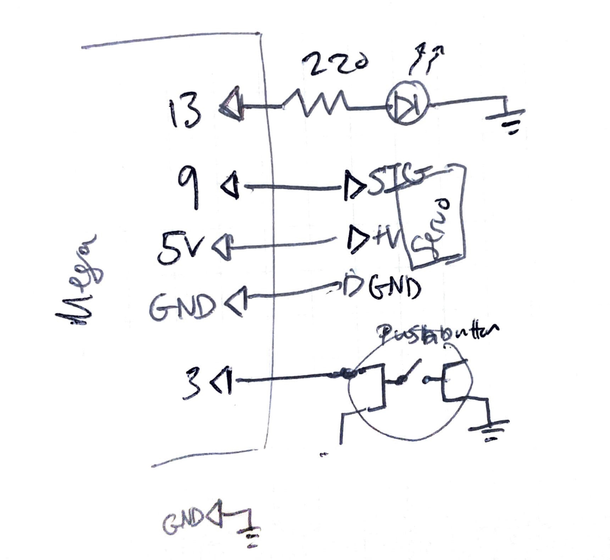

parent::[tmi Examples](tmi%20Examples.md)
previous:: [tmi12 Serial Input Basics](tmi12%20Serial%20Input%20Basics.md)
next:: [tmi15 Multitasking-2](tmi15%20Multitasking-2.md)
level:: #beginner 
garden-topic:: [Multitasking and non blocking delays](../../Multitasking%20and%20non%20blocking%20delays.md), [../../User Defined Functions](../../User%20Defined%20Functions)

Desired Goal:
- rotate a servo back and forth, outputting the position to the Serial Monitor, using a pushbutton to start/stop, blinking an LED at a rate proportional to the position (e.g. fast blinking at position 0 and slow blinking at position 180).

Concepts:
- used Functions to split up the code to be more readable
- used non-blocking functions to allow us to multitask


Physical Setup:


Code:

- [x] 1 - Rotate the Motor Back and Forth
- [x] 2 - Add pushbutton to start/ stop
- [x] 3 - Add LED color indicator
4 - add a pot for speed control
- speed control will be more advanced concept than previous
5 - output to LCD

A tricky part was getting the LED to blink at a rate proportional to the motor position - at the correct _brightness_ when the **motor was paused**. Here the loop was always hitting a `digitalWrite(LED, LOW)` only one loop cycle after the `digitalWright(LED, HIGH)`, resulting in a very dim blink. We needed to add another timer to track a "falling" or turn off value - to make sure it had delayed enough from being "on" before we turned off. 

The key code is using the `tLedDelayFalling` variable (set to `10ms`), which resulted in a brighter LED when the motor was paused. 

```c
void updateLED() {
  if (thisServoStarted) tLedDelayRising = map(pos, 0, 180, 50, 1000);

  if ((tNow - tPreviousLed >= tLedDelayRising)) {
    tPreviousLed = tNow; 
    digitalWrite(RED, HIGH);

  } else if (tNow - tPreviousLed >= tLedDelayFalling) {
    digitalWrite(RED, LOW); // need to add a falling timer so that we can light up brighter on time offs
  }
}
```

**Full Code**:

``` c
// Learning Objective: Demonstrate multitasking capabilities with non-blocking functions
// (without using OOP paradigm)
// Move a servo motor back and forth while changing the blink rate of an LED
// Blink rate is proportional to the motor position
// Pressing a pushbutton press stops motor movement, LED blinking continues

#include <Arduino.h>
#include <Servo.h>

// Pins
const byte PIN_SERVO1 = 9; // 9 <- SIGNAL (byte [0, 255])
const int BUTTON = 2; // 11 <- Button (will be normal HIGH)
const int RED = 13;

// Variables
unsigned long tNow; // for each time through the loop

// LED
unsigned long tLedDelayRising = 5;
const int tLedDelayFalling = 10;
unsigned long tPreviousLed = 0; 

// Servo Object and Variables
Servo thisServo; 
boolean thisServoStarted = false; // state machine variable
int pos = 0; // store position
int delta_pos = 1; // {1, -1}
unsigned long tPreviousStep = 0;
unsigned long tDelay = 20; // instead of constant, it will be set by the motor position

// Button and Debouncing
unsigned long tDebounceStart; // to store time for debouncing algo
const int tDebounceDelay = 30;
boolean debouncing = false;
int buttonState = 0; 
int buttonPreviousState = 1; // button is INPUT_PULLUP so normal is HIGH, active LOW

void setup() {
  pinMode(RED, OUTPUT);
  pinMode(BUTTON, INPUT_PULLUP);
  digitalWrite(BUTTON, HIGH); // to avoid ambiguity

  thisServo.attach(PIN_SERVO1);
  Serial.begin(9600);
}

void updateLED() {
  // flash the LED at a speed relative to the motors position
  // this will demonstrate "loops within loops" for multitasking purposes
  // keep flashing if button is unpressed
  if (thisServoStarted) tLedDelayRising = map(pos, 0, 180, 50, 1000);

  if ((tNow - tPreviousLed >= tLedDelayRising)) {
    tPreviousLed = tNow; 
    digitalWrite(RED, HIGH);

  } else if (tNow - tPreviousLed >= tLedDelayFalling) {
    digitalWrite(RED, LOW); // need to add a falling timer so that we can light up brighter on time offs
  }
}

// The beginning of the "state machine"
void servoStart() {
  // Set state
  thisServoStarted = true;
  Serial.println("Started Servo");
//  tPreviousStep = tNow; // #q do we need this? -> I think we do, otherwise it starts instantaneously and jitters
}

// Start the Servo Rotating - reverse directions when we get to the end;
void moveServoOneStep() {
// first check if we should actually move one step
// two conditions: 1) we are started and 2) the time condition has been met
  if (thisServoStarted && (tNow - tPreviousStep >= tDelay)) {
    pos += delta_pos; // increment the position to write new position
    thisServo.write(pos); 
    Serial.print("Moved Servo to position = ");
    Serial.println(pos);

    if (pos == 180 || pos == 0) delta_pos = -delta_pos; 
    // update timer
    tPreviousStep = tNow; // #q - or should we use `millis()` function again? s
  }
}

void servoStop() {
  thisServoStarted = false;
//  tPreviousStep = tNow; 
  Serial.println("Stopped Servo");
}

void servoChangeState() {
  Serial.print("Changing Servo state from (");
  Serial.print(thisServoStarted);
  Serial.println(")");
  switch (thisServoStarted) {
    case false:
      servoStart();
      break;
    case true:
      servoStop();
      break;
  }
}

void checkButton() {
  buttonState = digitalRead(BUTTON); // INPUT_PULLUP
  if (buttonState != buttonPreviousState) {
    tDebounceStart = tNow; // #q again, should this be tNow or millis()
    buttonPreviousState = buttonState; 
    debouncing = true;
    Serial.println("Started Debouncing...");
  }
  else if (debouncing && buttonState == 0 && (tNow - tDebounceStart >= tDebounceDelay)) {
    Serial.print("Debouncing finished, taking current state = ");
    Serial.println(buttonState);
    // stop or start the motor
    servoChangeState();
    // update the variables
    debouncing = false;
  }
}

// Loop
void loop() {
  tNow = millis(); 

  checkButton();
  moveServoOneStep(); 
  updateLED();
  }
```

Improvements:
- add in a potentiometer as a controller and an LCD to display position
- start to use object oriented programming structures

Outstanding Questions
- see `#q` in the code 
	- when updating the time of a non-blocking time variable, should we use the `tNow` which grabs the `millis()` at the beginning of the main `loop()` or should we call  `millis()` again each time? 