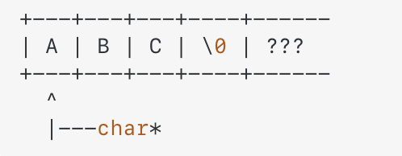

parent::[Pointers](Pointers.md)

Pointers are often used to create strings. You'll commonly see 

```cpp
const char* ptr = "Some literal string";
```

Here we have created a _mutable_ pointer to an _immutable_ character. The address held by the pointer is not the whole address of the string, but rather just the address of the first char, which takes up 1 byte. (see [Arduino Variable Types](Arduino%20Variable%20Types.md)). We can then increment the pointer (address) to access the next char in the string.



The syntax can get tricky depending on where the asterisk and `const` key word is:


### Examples
- Used in [tmi 16 Object Oriented Programming](Personal%20Folders/that_marouk_ish/tmi%2016%20Object%20Oriented%20Programming.md) to `Serial.print()` from within a custom class.