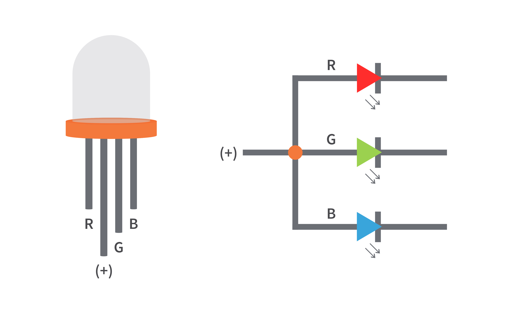

parent:: [LEDs](LEDs.md)

> Note: we need to include resistors for _each individual LED_ due to the difference in voltage drop for each color.

**Common Anode**:
Single wire connected to the positive/anode lead.

**Common Cathode**:
Single wire connected to negative/cathode lead (need to provide +5V to each of the R,G,B leads)
   

> We must use individual resistors for each LED color due to 1) the differences in forward voltage for each color and 2) variable current through each LED based on how bright or dim they are see  https://www.circuitbread.com/tutorials/how-rgb-leds-work-and-how-to-control-color and https://www.circuitbread.com/tutorials/why-cant-i-share-a-resistor-on-the-common-anode-or-cathode-of-my-rgb-led

Source: [elegooCompleteStarterMega2560](elegooCompleteStarterMega2560)

**Datasheet**

